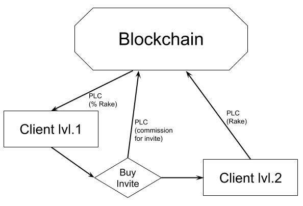

# Referral program

To get an account in the blockchain is to have an invite code from someone from the players or affiliates.

_Fig. 1_ Rake distribution

> 15% - to node owner

> 10% - to witnesses 

> 75% - distribution between members of the referral network

## How referral network works

Multi-level system with the same logic for all levels, where the amount of payment depends on PLC count on client’s balance.

_Fig. 2_ Referral chain

Spec:

* 75% of the generated rake of each client is distributed between all clients of the referral network in upper levels. For example, 75% of the generated rake by client 21 will be distributed between clients 11 and 0.
* The distribution between the levels goes as follows: each level has the opportunity to receive a maximum of 93.33% of the amount of rake, the rest will go to the next up layer and share. For example, if client 21 generated a rake, then rakeback (75% of rake) will be sent to upper layer and distributed as follows: client 11 will receive a maximum of 93.33% of the incoming rakeback, the rest will go upper layer and the next will receive 93.33% from the rakeback and so on.
* To the top unconditionally goes 5% of the generated rake or in terms of 6.67% coming through the chain shared by the referral program. Variable remaining part of 70% of the generated or 93.33% of the rolling on the chain of the referral program.
* Each client who receive rakeback from the down layers network can receive from 0 to 100% of the due amount of rakeback, depending on the volume of PLCs on its balance. The coefficient k ( k = min (Balance / 100; 1), i.e. the balance must be more then 100 PLC to receive the maximum possible rakeback). For example, if customer 21 generated rake 100 PLC, then rakeback 100 * 75% = 75 PLC will go to upper. Suppose a client 11 has  50 PLC on balance. This means that he will receive 70PLC * 93.33% * 0.5 = 32.67PLC, since k is 0.5 for this. The remaining amount will go upper. At the same time, if he had 100 PLCs on his balance, he would receive a maximum of 70 PLCs. 5 PLC goes up in any case.
* If the account has less than 10 PLC - the client will not receive the rake and all 100% of the rakeback will go to the node above. For example, if client 21 generated 100 PLC rake, then client 11 relies on 75 PLCs from the referral program. But if client 11 has less than 10 PLCs, then all 75 PLCs go to client 0.
* The size of the rake of each game will be counted from the final game bank and will be shared equally among all the players involved in the distribution without taking into account each contribution share. For example, if the distribution involved first 5 players who contributed 100 to the bank (500 in total), and only 2 reached the end, who still added 500 more to the bank (total 1500), then the total rake is 60 chips and at the same time, 12 chips will be counted as rake generated each player.
* Payments are made at a certain service interval (default 4 hours)
* Payment is made to the accumulation fund, separate for each type of network participant: node owner, witness, invitation creator. User can have a role of any type both individually and jointly. For example, at the same time can be both the node owner and the witness.
* The user can transfer the accumulated funds from the fund to the his balance.

**The percentages indicated in the document may change as a result of the voting by the node holders.**
