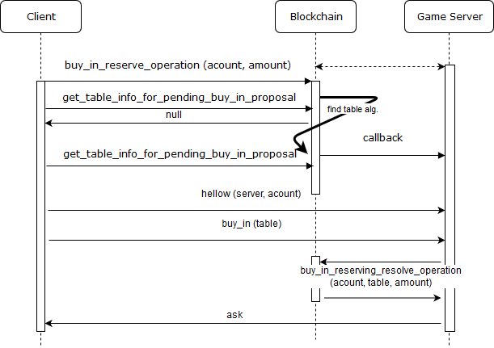
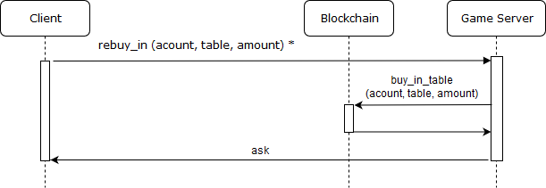
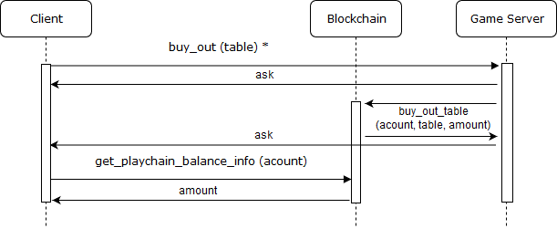

# Basics of the PlayChain System

The functionality of the PlayChain subsystem is designed:

To keep track of players' funds and payments in accordance with the [referral program](./playchain_affiliate_allocation.md) and room owners. Equitable distribution of players by room.
To combat fraud by both players and room owners. Refunds of players in case of fraud or glitch game servers.

Main objects of business logic:

* Room
* Table
* Room (table) owner
* Witness
* Player

The main function of the blockchain is to account for the movement of digital money (hereinafter simply “funds”) of users. In the context of the described functional, the following types of movement of funds will be considered:

* The player provides funds to the game table.
* Player returns the funds.
* The system returns the funds to the player
* The player's funds on the gaming table change according to the results of the game process.

Next funds movements are described in common in document [referral program](./playchain_affiliate_allocation.md):

* The table owner receives a portion of the funds as a result of the gameplay.
* The affiliate system member receives a portion of the funds as a result of the gameplay

To provide games (usually with the purpose of earning income), the blockchain user creates the “room” object and becomes its owner. In the room, the owner creates tables with specified characteristics (in the blockchain, the characteristics of the table are just a row with meta information in a distributed database). The owner of the room is the “table owner” that he created in his room.

In PlayChain, the owner of the room is also an "witness" for tables in other people's rooms. Witnesses are motivated to obtain part of the funds as a result of the game process.

Only special blockchain user can participate in games: “player”. The user becomes a player automatically when it is created by inviting the PlayChain subsystem. The table owner can also make a player from a regular blockchain user (if he has already been created using BitShares blockchain tools)

## Basics operations 

For the game the table owner must collect players. The collection operation is carried out in two stages (Fig. 1).

_Fig. 1_ The procedure of boarding the table

At the first stage, the player transfers part of his funds (for which he wants to play) to PlayChain, indicating the protocol version and information about the game in which he wants to participate.
For TotalPoker, information about the game consist of 'big blind' and constants for converting funds to 'chips'. This TotalPoker-specific information is transmitted to PlayChain in one line (as meta information).
Then PlayChain, when forming the next block, searches the table.
with the appropriate meta-information and version of the protocol (performs **find table algorithm**).

While searching is getting, it may be used various additional criteria that take into account the table load and the composition of participants, as well as the rating of room owners (see [room rating system](./playchain_room_rating.md).

The player (or rather, the client application) is waiting for the completion of the table search algorithm according to the algorithm shown in Fig. 2

_Fig. 2_ Waiting for the table algorithm

The client forms the request ID ('proposal' at Fig. 2). In case of successful completion of the search, the table ID and the address of the game server are returned to the player ('table', 'address' at Fig. 2). In case of failure, the funds are returned to the player after the PBL time expires (Fig. 2).

At the second stage, the player establishes a connection with the game server and reports his desire to “sit down” at the gaming table with a 'buy-in' operation with an indication of the proposal identifier from the first stage (Fig. 1).

The game server of the server has feedback from PlayChain for its tables and he learns that the system has chosen his table for the player ('callback' at Fig. 1).

If the 'buy-in' is received by the game server, it signs the corresponding transaction with the key of the table owner and completes the player’s boarding procedure.

If the procedure was interrupted, for example, the game server is unavailable or did not want to accept the 'buy-in' (according to the game logic or lack of resources) before the PBL period has expired, the funds are returned to the player by the PlayChain system.

_Fig. 3_ The procedure for returning the player at the table

If the connection to the game server is lost, for example, if the mobile application with the game is disconnected from the network, the player is returned at the table (Fig. 3). First of all, the client contacts PlayChain to find out on which table he is registered. And if he really played at some table or did not work out timeout, he turns to the appropriate game server. In the absence of information in PlayChain or the failure of the current procedure, the client repeats the procedure of boarding the table (Fig. 1).

_Fig. 4_ The procedure for purchase during the game

If the client loses all the money during the game and wants to buy additional funds, he performs the re-purchase procedure. For the operation of adding funds to the table, PlayChain requires the signature of both the player and the table owner. Therefore, the client sends a signed transaction to the game server, server adds his signature and sends it to PlayChain, if this operation does not violate the game process (for example, the game has already ended and the players have not yet been collected). The symbol '*' in Fig. 4 means a signed operation.

_Fig. 5_ The procedure for leaving the player from the game

When the client decides to leave the game, he forms a corresponding transaction and sends it to the game server, so that he took it into account in the gameplay. The withdrawal of funds does not require the consent of the table owner (i.e., his signature), so the option of sending the command directly to PlayChain is possible, however, in this case there will be an additional delay in waiting for a 'callback'. So different implementation is possible depending on the requirements of the game.
The correctness of the withdrawal funds, when and in what amount of funds will be withdrawn is fully controlled by PlayChain. For example, the game may not be completed yet and the gain is unknown.

## Voting

The game server analyzes the composition of the players on its tables and makes a decision to start the game. In PlayChain, there is a timer to wait for the game after which the funds are returned to the player, and for boarding the table you will need to repeat the boarding procedure. Therefore, the game server must have time to start the game before the timer is completed.

To start the game, the server initiates the voting procedure. Notifies players about the launch of the game.

After receiving a notification from the game server, each player on his own behalf, as well as the game server itself on behalf of the table owner, send a vote to PlayChain for the start of the game based on their game model.

The vote of the beginning of the game consists of the following data, signed by the key of the voting member: 

1. A list of amounts for each participant in the game (usually * corresponds to the player’s transfer to the table for each player, taking into account the result of the games).
2. Meta-information of the game (for Texas Hold'em, this may be information about who the dealer is).

Voting can be held for participation in the game of a smaller number of players than the number of those who donated funds. And also with fewer funds. However, unused funds will be returned to the players in accordance with the timer waiting for the game.
The inadmissibility of the transfer of a larger amount than was stated in the procedure for boarding is controlled by PlayChain.

The voting procedure is designed to ensure fairness at the initial and final (to be discussed later) stages of the game. eliminate the possibility of falsification of the game model from both the player and the table owner.

PlayChain expects the votes of the participants during a small time interval or until its end (if all the votes are collected).
Expected votes from all the declared participants of the game according to the owner of the table (as this is affected by the rules of a particular game).
PlayChain also receives votes from witesses who can compensate for the lack of votes from other participants in the game (other than the table owner). The compensation factor (how many votes as a percentage can be replaced) is set in the PlayChain settings.

Voting is considered successful if before the expiration of the timer the necessary number of votes has been collected and the condition has been fulfilled:

,

where:  
P - 100 %;   
m - number of different votes;  
N - number of votes;  
R - constant (60 % by default).

For the vote, the vote is selected, which sent the maximum number of participants. In accordance with the data of this vote movements are made. To vote for the start of the game, they are marked as funds in the game and the timeout is no longer valid.

When comparing votes, PlayChain does not analyze their contents, but considers [RIPEMD-160](https://en.bitcoin.it/wiki/RIPEMD-160) from the vote data.
The resulting hash for the same votes must match. The exception is the command to reset the result when the list of funds entered into the game or the results is empty. Those. PlayChain verifies that the list is empty.

The table transits from the 'Voting for Playing' state into the new 'Playing' state (Fig. 6).

For the 'Playing' status, a new timeout is applied after which the table will be returned to the 'Free' state, and all funds on the table will be returned to the players. Thus, the server crash on the table where the game is played is taken into account.

 object behavior")

_Fig. 6_ Table state transition scheme сombined with vote (V) object behavior

'Pending' in Fig. 6 means that the vote is accepted by PlayChain, but the status is not switched and the vote will be considered only after the status is switched, i.e. determining whether the transition is 'Voting Completed'. This is done to avoid technical delays between games due to a discrete change in the state of the distributed blockchain base.

Next type of voting is used to sum up the game.

After summarizing the game will need to run again. Depending on the type of game, this procedure can be hidden from the player or match the game logic as in the case of poker (where voting is repeated every new hand).

The vote for the result of the game is the following data, signed by the key voting member:

1. A list of the amounts for each participant in the game at the current moment, with an indication of the rake parts to the table owner from each winner (if such is provided for by the logic of the game) It takes into account the gane and losses of players if they have happened since the last vote.  
2. Meta-information of the game (game log from the moment of the last voting procedure for the beginning)

Votes are collected during a short timeout, but voting can end early if the required number of votes has been collected.
Voting cannot be held for fewer votes than the number of those who participated in the game. However, the PlayChain settings provide for the loss of a certain number of votes after the timeout expires. Those. if the timeout has worked and there is a shortage of a specified number of players' votes, it is considered that the votes have been collected and the quorum is calculated.
As in the case of voting for the start of the game, the votes of the participants in the game may be replaced by witnesses, if allowed by the PlayChain settings.
It is important that at this stage votes from witnesses who took part in the voting for the start of the game are required.
Thus, an unstable connection of players to the server or their explicit disconnection is taken into account, however, a stable connection with witnesses is required. In case of failures of connections with witnesses, their ratings are recalculated and downgraded.

For the voting, a vote with the maximum number of voters is also selected. In accordance with the data of this vote movements are made. Funds on the table are given in accordance with the data of the selected vote and timeout begins to act on them.
The table moves from the 'Voting for Result' state to the new 'Free' state (Fig. 3)

Thus, the player, starting with the boarding procedure, periodically participates in voting during transitions between the statuses 'Free', 'Playing', 'Free' while he has a positive balance on the table or he hasn’t completed the leaving procedure.

When a player does leaving procedure, if it concerns the means in the game, the funds will be returned to the player by PlayChain only after the next voting for the result. Those. will wait for confirmation of the correctness of the claimed amount by voting on the result

## Overview of PlayChain operations

The list of **operations** sent in transactions by protocol participants (described above):

| | |
|---|---|
| buy_in_reserve_operation | Placement of the proposal to participate in the game (Fig. 1) |
| buy_in_reserving_cancel_operation | Cancellation of the proposal (by ID) |
| buy_in_reserving_cancel_all_operation | Cancellation of all player proposals |
| buy_in_reserving_resolve_operation | Acceptance of the proposal by the table owner (Fig. 1) |
| buy_in_table_operation | Transfer of funds to the table (Fig. 4) |
| buy_out_table_operation | Placing a withdrawal request (Fig. 5) |
| game_start_playing_check_operation | Voting for the start of the game |
| game_result_check_operation | Voting for the result of the game |
| game_reset_operation | Reset the game (accompanied by a refund at the time of the operation). It is performed only on behalf of the owner of the table in accordance with the game process or some errors (for example, restarting the server) |

The list of **virtual transactions**. Those. operations not transferred by network participants in transactions, but generated by PlayChain itself upon the occurrence of certain events:

| | |
|---|---|
| buy_in_reserving_allocated_table_operation | Successful completion of a table search for the specific proposal |
| buy_in_reserving_expire_operation | Proposal cancellation by the timer |
| buy_in_expire_operation | Funds return by the timer |
| game_event_operation | Complex operation for game event (see below) |

Subset for game_event_operation:

| | |
|---|---|
| game_start_playing_validated | Successful transition of the gaming table to the 'Playing' state (Fig. 6) |
| game_result_validated | Successful transition of the gaming table to the 'Table Free' state (Fig. 6) |
| game_rollback | The game is canceled. Funds restored to the start of the game. |
| fail_consensus_game_start_playing | * |
| fail_consensus_game_result | * |
| fail_expire_game_start_playing | * |
| fail_expire_game_result | * |
| fail_expire_game_lifetime | * |
| fraud_game_start_playing_check | * |
| fraud_game_result_check | * |
| buy_out_allowed | Reviewed and executed the return of funds blocked during the game (deferred 'buy-out') to the player’s balance |
| buy_in_return | Return of funds from the table to the player’s balance |
| game_cash_return | Return of funds from the game on the table |
| fraud_buy_out | * |
| fail_vote | Cancellation of the individual member’s voting attempt |

Events with the prefix 'fail' are recorded by PlayChain as fraud or unstable operation of the gaming service and can be used for qualifying ranking of players and table owners.

Here is example of a fail-operation when a consensus is broken for a 60% threshold (R): 

> If one of the three votes (N = 3) is different (m = 2), then a consensus is reached (according to the formula inequality is fulfilled), but for a different vote fraud_game_start_playing_check_operation or fraud_game_result_check_operation will be recorded (depending on the type of voting). Funds on the table will be synchronized, and pending 'buy-out' considered by the result of the majority.

The list of PlayChain operations is wider than the one presented above. To familiarize yourself with all possible operations see [PlayChain source code](https://github.com/totalgames/playchain-core)

