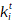
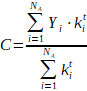
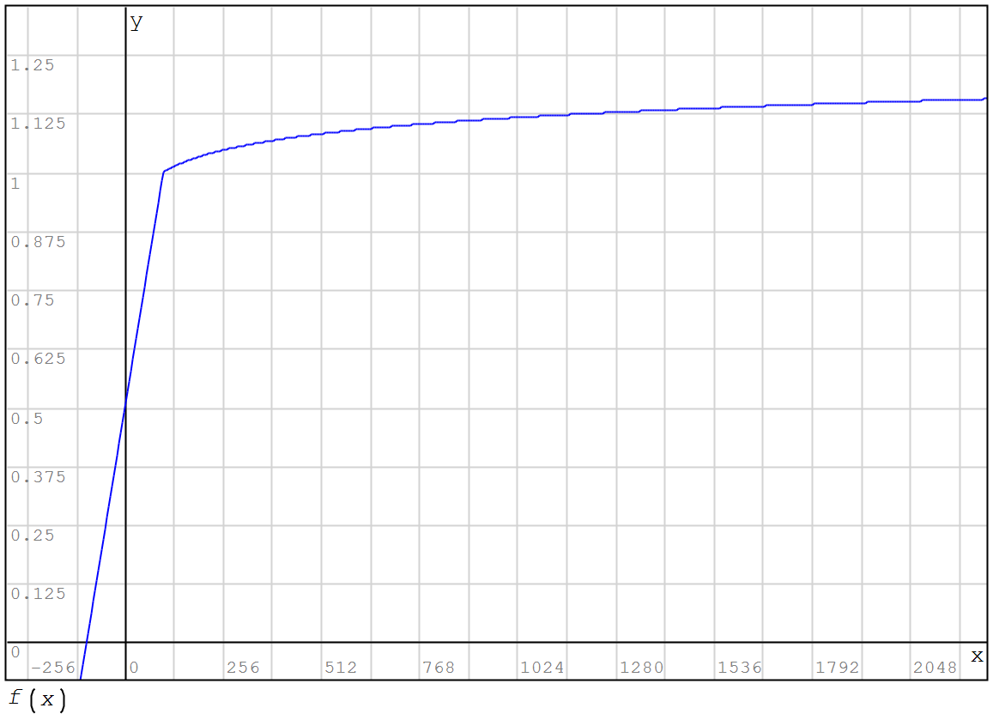

# Room Rating System

Rating formula:

,

where  
W - total rating;  
m - statistical correction, m = 25;  
C - average by all rooms score considering time factor (calculates in maintance block);  
f - score function value;  
 - time dependent coefficient;  
 - assigned to room score for the request processing (In the 1-st version only buyin-requests are counted).

If after receiving 'buy-in'-request from client blockchain finds a room and table that are supposed to give a service to this client and the room performs 'resolve' operation ([basics operations Fig. 1](./playchain_basics.md)), thereby confirming that client received a service, than a score “1” will be assigned to the room.
If blockchain finds a room and table that are supposed to give a service to the client but chosen room don’t do the resolve the operation within the allowable time than blockchain will consider the room is not working and assign it the score “0”, thereby lowering the rating of the room.

## Detailed component description of the formula

### Total room score with regard to time factor is calculated by formula:

,

where  
Yi - score assigned to room;  
N - quantity of requests taking into consideration;  
 - time dependent coefficient;

> ,  
> if Xi >30,  
,  
> if Xi<=30,  
where X - number of minutes since client request up to current time;

e - base of natural logarithm.

The exponential dependency form is widely used to describe information aging processes. The exact form of the curve (shown in the Fig. 1) was established by the method of expert estimates.

_Fig. 1_

### Score with regard to time factor     

,

where  
 - time dependent coefficient (see above);  
N - quantity of requests taking into consideration.
    
### Average rating value with regard to time factor 

,

where  
 - time dependent coefficient (see above); 
Na - quantity of requests taking into consideration by all rooms.

### Score function

The final rating value is multiplied by the value of the function, depending on the number of client requests taken into consideration:

> If N<100, than f=(0.5 + N*0.005);  
> If N>=100, than f=((ln(N)/20)+0.76974),

where  
f - score function value;  
N - quantity of requests taking into consideration for the room.

The exact function curve is displayed in the graph Fig. 2.

_Fig. 2_

The function reaches 1 when N = 100.

**Taking into account the fact that the blockchain uses integer arithmetic all presented formulas below are multiplied by the coefficient P = 1000 to reduce the calculation inaccuracy.**

