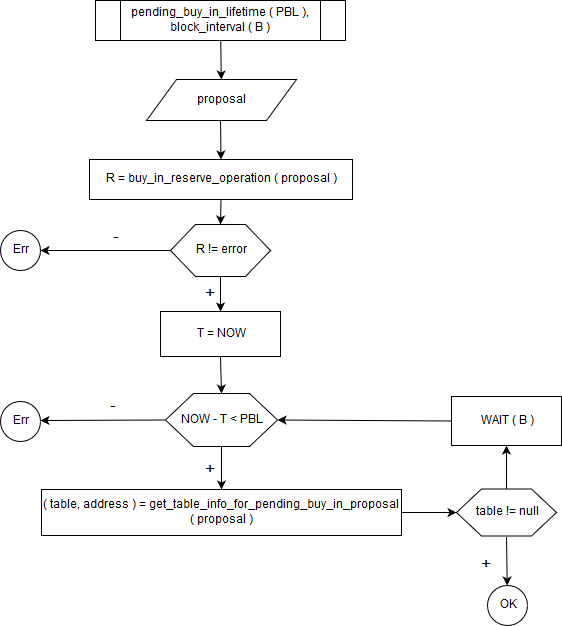
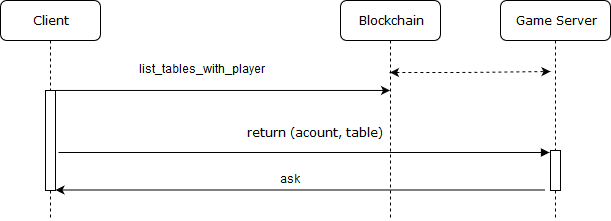
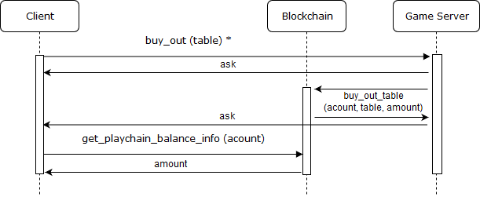
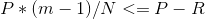
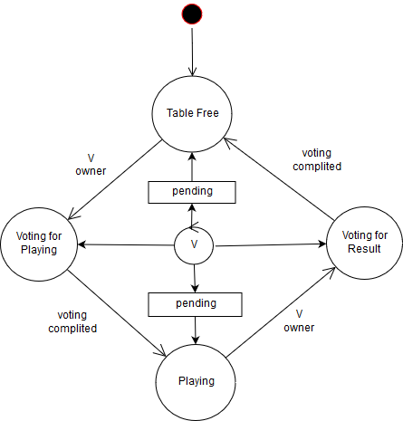

# Основы системы PlayСhain

Данный функционал подсистемы PlayChain предназначен:

Для ведения учета средств игроков и выплат в соответствии со [схемой распределения партнёрских отчислений](./playchain_affiliate_allocation_ru.md) и владельцам комнат. 
Справедливого распределения игроков по комнатам.
Для борьбы с мошенничеством как со стороны игроков, так и со стороны владельцев комнат.
Возврата средств игроков в случае мошенничества или сбоев игровых серверов.

Основные объекты бизнес-логики:

* Комната
* Игровой стол
* Владелец стола
* Наблюдатель
* Игрок

Основная функция блокчейн - это учет движения цифровых денежных средств (далее просто “средств”) пользователей. В контексте описываемого функционала будут рассматриваться следующие виды движения средств:

* Игрок предоставляет средства игровому столу.
* Игрок возвращает средства
* Система возвращает средства игроку
* Изменяются средства игрока на игровом столе по результатам игрового процесса

Движения средств:

* Владелец стола получает часть средств по результатам игрового процесса
* Участник схемы распределения партнёрских отчислений получает часть средств по результатам игрового процесса

описываются в общих чертах с документе [схема распределения партнёрских отчислений](./playchain_affiliate_allocation_ru.md)

Для проведения игр (как правило, с целью получения дохода) пользователь блокчейн создает объект “комната” и становится её владельцем. В комнате владелец создаёт столы с заданными характеристиками (в блокчейне характеристики стола это только строка с метаинформацией в распределенной БД). Владелец комнаты является “владельцем стола”, который он создал в своей комнате.

В PlayChain владелец комнаты является также “наблюдателем” для столов в чужих комнатах. Наблюдатели мотивируются получением части средств по результатам игрового процесса.

Участвовать в играх может специальный пользователь блокчейн: “игрок”. Пользователя становится игроком автоматически при его создании через приглашение подсистемы PlayChain. Владелец стола так же может сделать игрока из обычного пользователя блокчейн (если он уже создан средствами блокчейн)

## Основные операции

Для проведения игры владельцу стола необходимо собрать игроков. Операция сбора проводится в два этапа (Рис. 1).

_Рис. 1_ Процедура посадки игрока за стол

На первом этапе игрок передаёт часть своих средств (на которые он хочет играть) в PlayChain указав версию протокола и информацию об игре в которой он хочет участвовать. 
Для TotalPoker в качестве информации об игре используется стоимость 'big blind' и константы для пересчёта средств в 'chips'. Данная специфическая  для TotalPoker информация передается в PlayChain одной строкой (как метаинформация).
Далее PlayChain при формировании очередного блока осуществляет поиск стола 
с соответствующей метаинформацией и версией протокола.
При поиске могут использоваться разные дополнительные критерии учитывающие загруженность стола и состав участников, а так же рейтинг владельцев комнат (СМ [систему расчёта рейтинга комнат](./playchain_room_rating_ru.md).

Игрок (а точнее клиентское приложение) ожидает завершения алгоритма поиска по алгоритму указанному на Рис. 2

_Рис. 2_ Алгоритм ожидания поиска стола

Клиент формирует идентификатор заявки (proposal на Рис. 1). В случае успешного завершения поиска игроку возвращается идентификатор стола и адрес игрового сервера его обслуживающего (table, address на Рис. 1). В случае неудачи средства возвращаются игроку по истечении времени PBL (Рис. 1)

На втором этапе игрок устанавливает соединение с игровым сервером и сообщает свое желание “сесть” за игровой стол операцией 'buy-in' с указанием идентификатора заявки из первого этапа (СМ Рис. 2). 

У игрового сервера обслуживающего стол установлена обратная связь с PlayChain для своих столов и он узнаёт о том, что система выбрала его стол для игрока (callback на Рис. 2).

Если 'buy-in' принимается игровым сервером он подписывает соответствующую транзакцию ключом владельца стола и завершает процедуру посадки игрока за  стол.

Если процедура A была прервана, например игровой сервер недоступен или не захотел принять 'buy-in' (по игровой логике или нехватке ресурсов) до истечения периода PBL, средства возвращаются игроку системой PlayChain.

_Рис. 3_ Процедура возврата игрока за стол

При потери соединения с игровым сервером, например при отключении мобильного приложения с игрой от сети, осуществляется процедура возврата игрока за стол (Рис. 3). В первую очередь клиент обращается в PlayChain чтобы узнать на каком столе он зарегестрирован. И если он действительно играл за каким-то столом или не сработал таймаут, он обращается на соотвествующий игровой сервер. В случае отсутствия информации в PlayChain или сбоя текущей процедуры клиент повторяет процедуру посадки за стол (Рис. 1). 

_Рис. 4_ Процедура докупки в процессе игры

Если в процессе игры клиент проиграл все деньги и хочет докупить средства, он выполняет процедуру докупки. Для операции добавления средств на стол PlayChain требует подписи как игрока, так и владельца стола. Поэтому клиент отправляет подписанную транзакцию на игровой сервер, тот добавляет свою подпись и отправляет в PlayChain, если данная операция не нарушает игровой процесс (например игра уже завершилась и игроки ещё не собраны). Символ '*' на Рис. 4 означает подписанную операцию.

_Рис. 5_ Процедура выхода игрока из игры

Когда клиент принимает решение покинуть игру он формирует транзакцию 
вывода стредств и отправляет её игровому серверу, чтобы тот учёл это в игровом процессе. На вывод средств не нужно согласие владельца стола (т.е. его подпись), поэтому возможен вариант с отправкой команды непосредственно в PlayChain однако в этом случае будет дополнительная задержка на ожидание 'callback'. Т.о. возможна различная реализация в зависимости от требований игры.
Корректность команды вывода средств, когда и в каком объёме средства будут выведены полностью контролируется PlayChain. Например игра может быть еще не завершена и неизвестен размер выйгрыша. 

## Голосование

Игровой сервер анализирует состав игроков на своих столах и принимает решение о запуске игры. В PlayChain существует таймер на ожидание игры по истечении которого средства возвращаются игроку и для посадки за стол нужно будет повторить процедуру посадки. Поэтому игровому серверу нужно успеть запустить игру до завершения таймера. 

Для запуска игры сервер инициирует процедуру голосования. Уведомляет игроков о запуске игры.

Получив уведомление от игрового сервера каждый игрок от своего имени, а также сам игровой сервер от имени владельца стола, отправляют в PlayChain голос за начало игры исходя из своей игровой модели.

Голос за начало игры представляет собой следующие данные, подписанные ключом участника голосования: 

Список сумм по каждому участнику игры (обычно* соответствует переданной каждым игроком в процедуре посадки игрока за стол с учётом результата  игр)
Метаинформация игры (для техасского холдема это может быть информация о том, кто является диллером)

Голосование может проводиться за участие в игре меньшего количества игроков чем количество тех, кто передал средства. А также с меньшим количеством средств. Однако неиспользованные средства будут возвращены игрокам в соответствии с таймером на ожидание игры.
Недопустимость передачи большей суммы чем была заявлена в процедуре посадки за стол контролируется PlayChain.

Процедура голосования призвана обеспечить честность на начальном и заключительном (будет рассмотрен далее) этапах игры т.е. устранить возможность фальсификации игровой модели как со стороны игрока, так и со стороны владельца стола.

PlayChain ожидает голоса участников в течении небольшого временного интервала или до его окончания (если все голоса собраны). 
Ожидаются голоса от всех заявленных участников игры по версии владельца стола (так как на это влияют правила конкретной игры).
PlayChain также принимает голоса от наблюдателей, которые могут компенсировать нехватку голосов от других участников игры (кроме владельца стола). Коэффициент компенсации (сколько голосов в процентном соотношении может быть замещено) задаётся в настройках PlayChain.

Голосование считается успешным, если до истечения таймера собрано необходимое количество голосов и выполнилось условие:

,

где:  
P - 100 %;   
m - количество различных вариантов голосов;  
N - количество голосов;  
R - константа (60 % по умолчанию).

Для состоявшегося голосования выбирается голос, который прислало максимальное количество участников. В соответствии с данными этого голоса производятся движения средств. Для голосования за начало игры они помечаются как средства в игре и на них перестаёт действовать таймаут.

При сравнение голосов playchain не анализирует их содержимое, а считает  [RIPEMD-160](https://en.bitcoin.it/wiki/RIPEMD-160) от данных голоса. 
Полученный хэш для одинаковых голосов должен совпадать. Исключением является команда сброса результата, когда список вводимых в игру средств или результатов пуст. Т.е. playchain проверяет факт того, что список пуст.

Стол переходит и состояния 'Voting for Playing' в новое состояние 'Playing' (СМ Рис. 6).

Для статуса Playing действует новый таймаут по истечении которого стол будет возвращен в состояние “Free”, а все средства на столе возвращены игрокам. Таким образом учитывается аварийное завершение сервера на столе которого проводится игра.

_Рис. 6_ Совмещенная схема переходов состояний стола при голосовании (V на схеме)

'Pending' на Рис. 6 означает, что голос принимается PlayChain, но переключения статуса не происходит и голос будет учтен только после переключении статуса, т.е. определении наличия перехода 'voting completed'. Это делается для избежания технических задержек между играми из-за дискретного изменения состояния распределённой базы блокчейн.

Для подведения итога проводится голосование за результат игры.

После подведения итога игру нужно будет запускать снова. В зависимости от типа игры 
эта процедура может быть скрыта от игрока или соответствовать игровой логике как в случае покера.

Голос за результат игры представляет собой следующие данные, подписанные ключом участника голосования:

Список сумм по каждому участнику игры на текущий момент с указанием отчислений владельцу стола (если таковые предусмотрены логикой игры). Здесь учитывается выигрыш и проигрыш игроков если таковые случились с момента последнего голосования.
Метаинформация игры (лог игры с момента последней процедуры голосования за начало)

Голоса собираются в течении небольшого таймаута, но голосование может завершиться раньше, если собрано необходимое количество голосов.
Голосование не может проводиться для меньшего количества голосов чем количество тех, кто принимал участие в игре. Однако настройками PlayChain предусмотрена потеря некоторого количества голосов по истечении таймаута. Т.е. если сработал таймаут и не хватает некоторого указанного количества голосов игроков, считается что голоса собраны и производится расчет кворума.
Как и в случае с голосованием за начало игры, голоса участников игры могут замещаться наблюдателями, если это разрешено настройками PlayChain.
Важно, что на этом этапе требуются голоса от наблюдателей принявших участие в голосовании за начало игры.
Таким образом принимается в расчёт нестабильное соединение игроков с сервером или их явное отключение, однако требуется стабильное соединение с налюдателями. В случае сбоев соединений с наблюдателями происходит перерасчёт и понижение их рейтингов.

Для состоявшегося голосования также выбирается голос с максимальным количеством проголосовавших. В соответствии с данными этого голоса производятся движения средств. Средства на столе приводятся в соответствии с данными выбранного голоса и на них начинает действовать таймаут.
Стол переходит из состояния 'Voting for Result' в новое состояние 'Free' (СМ Рис. 3)

Таким образом игрок начав с процедуры посадки за стол периодически участвует в голосовании 
при переходах между статусами 'Free',  'Playing', 'Free' пока у него сохраняется положительный баланс на столе или он не выполнил процедуру выхода.

При выполнении процедуры выхода игроком, если она касается средств в игре, средства вернутся игроку PlayChain только после выполнения ближайшего голосования за результат. Т.е. будет ожидать подтверждения правильности заявленной на вывод суммы посредством голосования за результат.

## Обзор операций PlayChain

Список **операций** отправляемых в транзакциях участниками протокола (описанного выше)

| | |
|---|---|
| buy_in_reserve_operation | Размещение заявки на игру (Рис. 1) |
| buy_in_reserving_cancel_operation | Отмена заявки на игру (по идентификатору) |
| buy_in_reserving_cancel_all_operation | Отмена всех заявок игрока |
| buy_in_reserving_resolve_operation | Принятие заявки владельцем стола (Рис. 1) |
| buy_in_table_operation | Перевод средств на определенный стол (Рис. 4) |
| buy_out_table_operation | Размещение заявки на вывод средств (Рис. 5) |
| game_start_playing_check_operation | Голосование за начало игры |
| game_result_check_operation | Голосование за результат игры |
| game_reset_operation | Сброс игры (сопровождается возвратом средств на момент выполнения операции). Выполняется только от имени владельца стола в соответствии с игровым процессом или некоторыми ошибками (например перезапуск сервера) |

Cписок **виртуальных операций**.  Т.е. операций не передаваемыми в транзакциях участниками сети, а формируемых самим PlayChain при наступлении определённых событий:

| | |
|---|---|
| buy_in_reserving_allocated_table_operation | Успешной заверешние операции find_table по конкретной заявке |
| buy_in_reserving_expire_operation | Отмена заявки по таймеру |
| buy_in_expire_operation | Возврат средств по таймеру |
| game_event_operation | Составная операция события игры (СМ делее) |

Подмножество game_event_operation:

| | |
|---|---|
| game_start_playing_validated | Успешный переход игрового стола в состояние 'Playing' (Рис. 6) |
| game_result_validated | Успешный переход игрового стола в состояние 'Table Free' (Рис. 6) |
| game_rollback | Игра отменена. Средства восстановлены на состояние начала игры |
| fail_consensus_game_start_playing | * |
| fail_consensus_game_result | * |
| fail_expire_game_start_playing | * |
| fail_expire_game_result | * |
| fail_expire_game_lifetime | * |
| fraud_game_start_playing_check | * |
| fraud_game_result_check | * |
| buy_out_allowed | Рассмотрен и выполнен  возврат средств заблокированных на время игры (отложенный 'buy-out') на баланс игрока |
| buy_in_return | Возврат средств со стола на баланс игрока |
| game_cash_return | Возврат средств из игры на стол |
| fraud_buy_out | * |
| fail_vote | Отмена попытки голосования отдельного участника |

События с префиксом fail фиксируются playchain как мошенничество или нестабильная работа игрового сервиса и может быть 
использованы для квалификационного ранжирования игроков и владельцев столов.

Пример срабатывания fail-операции при нарушении консенсуса для порога 60 %:  для N = 3 все три голоса различны.
Для 2 одинаковых из 3 консенсус достигается (⅔ = 66.(6) %), для отличающегося голоса будет записано fraud_game_start_playing_check_operation или fraud_game_result_check_operation.  Средства на столе будут синхронизированы, а ожидающие 'buy-out' рассмотрены по результату большинства.

Список операций PlayChain более широк чем представленный выше. Для ознакомления со всеми возможными операциями СМ [исходный код PlayChain](https://github.com/totalgames/playchain-core) 
