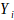
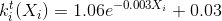

# Система расчета рейтинга комнат

Рейтинг рассчитывается по формуле:

,

где  
W - итоговый рейтинг;  
m - статистическая поправка, m = 25;  
C - средний по всем комнатам балл с учетом фактора времени (пересчитывается в каждом интервале обсуживания блокчейна);    
f - значение функции количества баллов;  
 - коэффициент, зависящий от времени;  
 - балл, присвоенный комнате за обработку запроса(в 1-й версии учитываются только 'buy-in' запросы. 

Если после получения 'buy-in' запроса от клиента блокчейн находит для клиента комнату и стол, а также комната выполняет 'resolve' операцию (СМ [основные операции Рис. 1](./playchain_basics_ru.md)), тем самым подтверждая, что клиент получил обслуживание - комнате присваивается балл “1”. Если блокчейн выдал клиенту комнату и стол, но от комнаты не пришла 'resolve' операция в течении допустимого времени - блокчейн считает, что комната находится не в рабочем состоянии и присваивает бал “0”, тем самым понижая рейтинг комнаты.

## Описание каждого из компонент формулы

### Балл, набранный комнатой, с учетом фактора времени в разрезе комнаты рассчитывается по формуле: 

,

где  
Yi - балл, присвоенный комнате;  
N - количество засчитанных баллов;  
 - коэффициент, зависящий от времени;  
> ,  
> при Xi >30,  
,  
> при Xi<=30,  
где X — число минут с момента обработки запроса комнатой до текущей даты;  

e — основание натурального логарифма.

Экспоненциальная форма зависимости широко используется для описания процессов устаревания информации. Точный вид кривой (представлен на Рис. 1) был установлен методом экспертных оценок.

_Рис. 1_

### Количество засчитанных баллов с учетом фактора времени:

,

где  
 - коэффициент, зависящий от времени (см. выше);  
N - количество засчитанных баллов.

### Среднее текущее значение рейтинга с учетом фактора времени:

,

где  
 - коэффициент, зависящий от времени (см. выше);  
Na - количество засчитанных баллов по всем комнатам.

### Функция количества баллов:

Финальное значение рейтинга умножается на значение функции, зависящей от количества засчитанных баллов:

> Если N<100, то f = (0.5 + N*0.005);  
> Если N>=100, то f = ((ln(N)/20)+0.76974),

где  
f - значение функции количества баллов;  
N - количество засчитанных баллов комнаты.

Точный вид функции отображен на графике Рис. 2.

_Рис. 2_

Значение функции количества баллов достигает 1 при N = 100.

**С учётом того, что в блокчейне применяется целочисленная арифметика, чтобы снизить погрешность расчета, все представленные формулы домножаются на коэффициент P=1000.**

